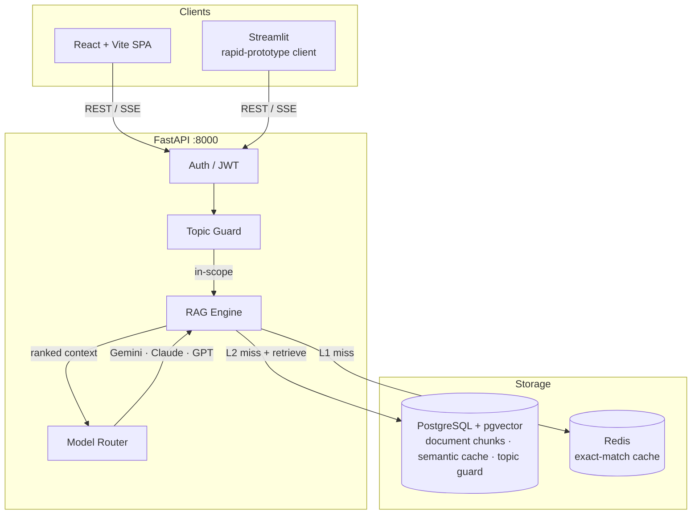

# Enterprise AI Chatbot

[](https://github.com/meraiky/Chatbot_Enterprise-AI/actions/workflows/ci.yml)
[](LICENSE)
[](https://www.python.org/)
[](https://nodejs.org/)
[](docker-compose.yml)
[](backend/migrations/)

A production-ready RAG chatbot for internal knowledge bases — hybrid retrieval, multi-model LLM routing, two-layer caching, and a full admin dashboard.

**New to this project? Start with [`QUICKSTART.md`](QUICKSTART.md) for a 5-minute setup guide.**

---

## Why this architecture?

Most RAG prototypes fail in production because of three problems: slow retrieval, expensive repeated LLM calls, and no guardrails against off-topic queries. This project addresses all three:

| Problem | Solution |
|---|---|
| Pure semantic search misses keyword-heavy queries | Hybrid BM25 + pgvector retrieval, cross-encoder reranking |
| Every question hits the LLM | Redis exact cache (L1) + pgvector semantic cache (L2) |
| No control over what the LLM answers | Topic guard blocks out-of-scope queries before any LLM call |
| Vendor lock-in on LLM provider | Pluggable model router — Gemini, Claude, GPT switchable at runtime |

---

## Key Features

- **Hybrid retrieval** — pgvector semantic search + BM25 keyword search, merged via RRF and reranked by cross-encoder
- **Two-layer cache** — Redis (exact match) → pgvector (semantic similarity) before any LLM call
- **Topic guard** — pgvector similarity check blocks prompt injection and off-topic queries
- **Multi-model routing** — route by model, cost cap, or availability; keys managed in Admin UI
- **PII redaction** — strips emails, phones, and other PII from logs and responses
- **Web search fallback** — Google / Bing / DuckDuckGo for queries outside document scope
- **Full admin dashboard** — users, API key pool, usage analytics, document management
- **Streaming responses** — SSE endpoint for chunk-by-chunk delivery

---

## Architecture



---

## Tech Stack

| Layer | Technology |
|---|---|
| Backend | FastAPI 0.115, Python 3.12 |
| Database | PostgreSQL 16 + pgvector |
| Vector store | PostgreSQL + pgvector (document_chunks) |
| Cache | Redis 7 |
| LLMs | Google Gemini, Anthropic Claude, OpenAI GPT (pluggable) |
| Embeddings | sentence-transformers/all-mpnet-base-v2 (local, 768 dims, no API key) |
| Reranker | sentence-transformers cross-encoder |
| Keyword search | BM25 (rank_bm25) |
| Frontend | React 18 + TypeScript + Vite 5 + Tailwind CSS |
| State | Zustand |
| Auth | JWT + bcrypt |
| Migrations | Alembic |
| CI/CD | GitHub Actions + Docker |

---

## Quick Start

> **First time?** See [`QUICKSTART.md`](QUICKSTART.md) for a focused 5-minute guide with troubleshooting tips.
> For a full step-by-step walkthrough: [`docs/setup/FRESH_CLONE.md`](docs/setup/FRESH_CLONE.md).

### Prerequisites

- Docker and Docker Compose (recommended)
- OR: Python 3.12 + Node.js 20 + PostgreSQL 16 + Redis 7
- At least one LLM API key: [Google Gemini](https://aistudio.google.com/app/apikey), [Anthropic Claude](https://console.anthropic.com/), or [OpenAI](https://platform.openai.com/api-keys)

### Docker Setup (recommended)

```bash
git clone https://github.com/meraiky/Chatbot_Enterprise-AI.git
cd Chatbot_Enterprise-AI

# 1. Create .env and fill in required values
cp .env.example .env

# Generate secrets (copy output into .env)
python -c "import secrets, base64; print('JWT_SECRET_KEY=' + secrets.token_hex(32))"
python -c "import secrets, base64; print('ENCRYPTION_KEY=' + base64.b64encode(secrets.token_bytes(32)).decode())"
```

Minimum `.env` values to set:

```env
JWT_SECRET_KEY=<generated above>
ENCRYPTION_KEY=<generated above>
DATABASE_URL=postgresql://postgres:postgres@db:5432/aiagent_db   # default for Docker
```

```bash
# 2. Start the stack (first run downloads ~420 MB sentence-transformers model — be patient)
docker compose up --build -d

# 3. Wait for backend to be healthy, then run migrations
docker compose exec backend alembic upgrade head

# 4. Seed demo users and topic-guard patterns
make seed
# ⚠️ IMPORTANT: Copy the generated passwords from terminal output!

# 5. Add an LLM API key via the Admin UI
#    Log in at http://localhost:3000 with credentials from step 4 → Admin → API Keys
```

| Service | URL |
|---|---|
| React frontend | http://localhost:3000 |
| API + Swagger | http://localhost:8000/docs |

**Demo credentials after `make seed`:** Check terminal output for randomly generated passwords.

To use fixed passwords for development, set in `.env` before seeding:
```env
SEED_ADMIN_PASSWORD=admin1234
SEED_ALICE_PASSWORD=alice1234
```

> **First-run note:** `sentence-transformers/all-mpnet-base-v2` (~420 MB) downloads on first startup. The backend container will appear idle for 1–3 minutes — this is normal. Watch progress with `docker compose logs -f backend`.

### Manual setup (without Docker)

```bash
# Backend — requires Python 3.12 and a running PostgreSQL 16 + pgvector instance
cd backend
python -m venv .venv && source .venv/bin/activate   # Windows: .venv\Scripts\activate
pip install -r requirements.txt
cp .env.example .env          # fill DATABASE_URL, JWT_SECRET_KEY, ENCRYPTION_KEY
alembic upgrade head
python -m scripts.seed_demo
uvicorn main:app --reload --port 8000

# Frontend (new terminal)
cd frontend && npm install && npm run dev

# Streamlit client (optional)
cd frontend && pip install -r requirements.txt && streamlit run app.py
```

See [`docs/setup/RUN_LOCAL.md`](docs/setup/RUN_LOCAL.md) for a full manual setup guide including PostgreSQL + pgvector installation and the [demo onboarding guide](docs/setup/onboarding-demo.md).

### 🚀 Production Deployment
For deploying this system to a production environment (AWS, GCP, Azure, Railway, etc.), follow the **[`docs/deployment/PRODUCTION_GUIDE.md`](docs/deployment/PRODUCTION_GUIDE.md)**.

---

## API Reference

Full interactive docs at `http://localhost:8000/docs`.

| Endpoint | Description |
|---|---|
| `POST /api/v1/auth/login` | Get JWT token |
| `POST /api/v1/chat/message` | Chat (sync) |
| `POST /api/v1/chat/message/stream` | Chat (SSE streaming) |
| `POST /api/v1/document/upload` | Upload + index a PDF |
| `GET /api/v1/document` | List indexed documents |
| `GET /api/v1/usage/summary` | Token usage summary |
| `GET /api/v1/admin/keys` | Admin: API key pool |

---

## Project Structure

```
Chatbot_Enterprise-AI/
├── backend/
│   ├── app/
│   │   ├── api/v1/        auth · chat · document · users · admin
│   │   ├── core/          config · database · auth · logging
│   │   ├── middleware/    error handler · security
│   │   ├── models/        SQLAlchemy ORM
│   │   └── services/
│   │       ├── rag/           vector store · BM25 · reranker · cache
│   │       ├── llm_service    multi-provider LLM calls
│   │       ├── model_router   cost/availability routing
│   │       ├── credential     AES-256-GCM key encryption
│   │       ├── topic_guard    injection + off-topic blocking
│   │       ├── web_search     Google · Bing · DuckDuckGo fallback
│   │       └── usage_tracker  token accounting
│   ├── migrations/        16 Alembic migrations
│   ├── tests/             unit/ + integration/
│   └── Dockerfile
├── frontend/
│   ├── src/               React SPA (pages · stores · api client)
│   ├── app.py             Streamlit client
│   ├── Dockerfile         multi-stage nginx build
│   └── nginx.conf         SPA routing + /api/ proxy
├── docs/
│   ├── architecture/      system design · RAG pipeline · infrastructure
│   ├── setup/             run-local · database · web search
│   └── audits/            project audit notes
├── .github/workflows/     CI (test + lint) · CD (Docker push + deploy)
├── docker-compose.yml     full stack: backend · postgres · redis · frontend
├── docker-compose.dev.yml hot-reload overrides
├── Makefile               make dev / test / migrate / lint / clean
└── .env.example
```

---

## Design Decisions

**Why FastAPI over Node/Express?**
Native async, first-class SSE streaming, and tight Python AI ecosystem integration (LangChain, sentence-transformers). Pydantic gives runtime request validation for free.

**Why pgvector for everything (no ChromaDB)?**
Document chunks, semantic cache, and topic guard all live in the same PostgreSQL database. A single operational surface means one backup strategy, one monitoring dashboard, and transactional consistency between chunk writes and cache invalidation. Embeddings are generated locally via `sentence-transformers/all-mpnet-base-v2` (768 dims) — no external API call, no vendor lock-in, and 768 dims fits within Neon's HNSW index limit so ANN search is fast.

**Why two cache layers?**
Redis gives sub-millisecond exact-match hits. pgvector semantic cache catches near-duplicate questions that differ in phrasing. Combined hit rate is high enough to cut LLM calls by 40–60% on repeated internal FAQs.

**Why a pluggable model router?**
Different query types have different cost/quality tradeoffs. Simple factual lookups can go to a cheaper model; complex reasoning goes to a stronger one. The admin key pool lets ops teams swap providers without a code deploy.

**Why keep Streamlit?**
It serves as a low-friction client for internal users who don't need the full React UI, and as a development/testing surface. It is not the primary client and is not included in the Docker stack by default.

---

## Roadmap

See [`docs/`](docs/) for current architecture and known gaps.

Planned improvements:
- Multi-tenancy: per-org document namespaces
- Evaluation harness: RAGAS metrics for retrieval quality
- Auth: OAuth2 / SSO support

---

## Contributing

See [CONTRIBUTING.md](CONTRIBUTING.md) — branch strategy, code style, commit convention, PR checklist.

## Security

See [SECURITY.md](SECURITY.md) — vulnerability reporting and security design notes.

## License

[MIT](LICENSE)
