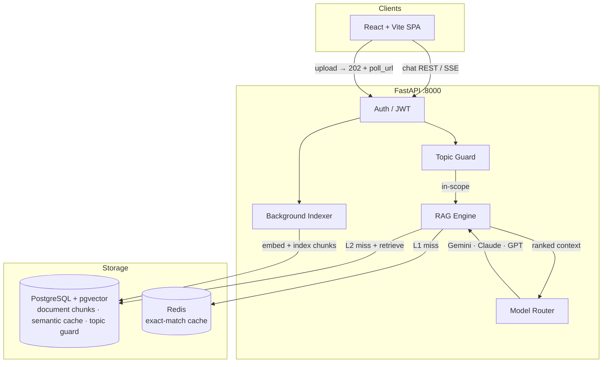

# Enterprise AI Chatbot

[](https://github.com/meraiky/Chatbot_Enterprise-AI/actions/workflows/ci.yml)
[](LICENSE)
[](https://www.python.org/)
[](https://nodejs.org/)
[](docker-compose.yml)
[](backend/migrations/)

A self-hosted enterprise AI chatbot for internal knowledge bases. It includes document upload, RAG search, streaming chat, user/admin management, and encrypted LLM API key management.

**New to this project? Start with [`QUICKSTART.md`](QUICKSTART.md) for a 5-minute setup guide.**

> 🎬 **[Watch demo video →](https://github.com/meraiky/Chatbot_Enterprise-AI/releases/download/v1.0.0/chatbot.mp4)** — upload, chat with documents, admin dashboard.

---

## What You Get

- **Chat over your documents** with PDF upload, indexing, citations, and streaming answers.
- **Admin dashboard** for users, documents, model settings, topic guards, and usage.
- **Bring your own LLM key** — each user configures their own key for Google Gemini, Anthropic Claude, or OpenAI via User Settings.
- **Self-hosted data layer** using PostgreSQL + pgvector instead of a separate vector database.
- **Docker-first setup** so a new user can clone the repo, fill `.env`, and run the stack.

---

## Why This Design?

The stack is intentionally compact: one backend, one frontend, one PostgreSQL database, and Redis for fast caching. The RAG internals are more advanced, but they are hidden behind the app so users do not need to configure every piece on day one.

| Problem | Solution |
|---|---|
| New users need an easy setup | Docker Compose runs backend, frontend, PostgreSQL, and Redis |
| Internal documents need search quality | pgvector semantic search + BM25 keyword search |
| LLM calls can get expensive | Redis exact cache + pgvector semantic cache |
| Teams use different LLM vendors | Per-user Gemini, Claude, and OpenAI keys managed via User Settings |
| Internal apps need guardrails | Topic guard and injection scanning run before LLM calls |

---

## Main Features

- Document upload and indexing
- Hybrid retrieval with citations
- Streaming chat responses
- Per-user LLM API key management (Gemini, Claude, OpenAI)
- Per-user model and routing configuration
- Topic guard and prompt-injection checks
- Usage tracking without storing raw prompts in analytics
- Optional web search fallback

---

## Simple Architecture



---

## Tech Stack

### Core App

| Layer | Technology |
|---|---|
| Backend | FastAPI 0.115, Python 3.12 |
| Frontend | React 18 + TypeScript + Vite 5 + Tailwind CSS |
| State | Zustand |
| Database / Vector Store | PostgreSQL 16 + pgvector |
| Cache | Redis 7 |
| Auth | JWT + bcrypt |
| Migrations | Alembic |
| Runtime | Docker Compose |
| CI/CD | GitHub Actions |

### AI / RAG Internals

| Feature | Technology |
|---|---|
| LLM providers | Google Gemini, Anthropic Claude, OpenAI |
| Embeddings | sentence-transformers/all-mpnet-base-v2, local 768-dim model |
| Semantic search | PostgreSQL + pgvector document chunks |
| Keyword search | BM25 via rank_bm25 |
| Reranking | sentence-transformers cross-encoder |
| Caching | Redis exact cache + pgvector semantic cache |
| Web search | Google, Bing, DuckDuckGo fallback |

> For a basic local demo, you only need Docker, `.env`, and one LLM API key. The RAG components run inside the backend.

---

## Quick Start

> **First time?** See [`QUICKSTART.md`](QUICKSTART.md) for a focused 5-minute guide with troubleshooting tips.
> For a full step-by-step walkthrough: [`docs/setup/FRESH_CLONE.md`](docs/setup/FRESH_CLONE.md).

### Prerequisites

- Docker and Docker Compose (recommended)
- OR: Python 3.12 + Node.js 20 + PostgreSQL 16 + Redis 7
- At least one LLM API key: [Google Gemini](https://aistudio.google.com/app/apikey), [Anthropic Claude](https://console.anthropic.com/), or [OpenAI](https://platform.openai.com/api-keys)

### Docker Setup (recommended)

```bash
git clone https://github.com/meraiky/Chatbot_Enterprise-AI.git
cd Chatbot_Enterprise-AI

# 1. Create .env and fill in required values
cp .env.example .env

# Generate secrets (copy output into .env)
python -c "import secrets, base64; print('JWT_SECRET_KEY=' + secrets.token_hex(32))"
python -c "import secrets, base64; print('ENCRYPTION_KEY=' + base64.b64encode(secrets.token_bytes(32)).decode())"
```

Minimum `.env` values to set:

```env
JWT_SECRET_KEY=<generated above>
ENCRYPTION_KEY=<generated above>
ENVIRONMENT=development
DATABASE_URL=postgresql://postgres:postgres@db:5432/aiagent_db   # default for Docker
```

```bash
# 2. Start the stack (first run downloads ~420 MB sentence-transformers model — be patient)
docker compose up --build -d

# 3. Wait for backend to be healthy.
# Migrations run automatically on backend startup.

# 4. Seed demo users and topic-guard patterns
make seed
# Without make: docker compose exec backend python -m scripts.seed_demo
# ⚠️ Copy the generated passwords from terminal output!

# 5. Add an LLM API key via User Settings
#    Log in at http://localhost:3000 with credentials from step 4 → User Settings → Models → Add Model
```

| Service | URL |
|---|---|
| React frontend | http://localhost:3000 |
| API + Swagger | http://localhost:8000/docs |

**Demo credentials after `make seed`:** Check terminal output for randomly generated passwords.

To use fixed passwords for development, set in `.env` before seeding:
```env
SEED_ADMIN_PASSWORD=admin1234
SEED_ALICE_PASSWORD=alice1234
```

> **First-run note:** `sentence-transformers/all-mpnet-base-v2` (~420 MB) downloads on first startup. The backend container will appear idle for 1–3 minutes — this is normal. Watch progress with `docker compose logs -f backend`.

### Manual setup (without Docker)

```bash
# Backend — requires Python 3.12 and a running PostgreSQL 16 + pgvector instance
cd backend
python -m venv .venv && source .venv/bin/activate   # Windows: .venv\Scripts\activate
pip install -r requirements.txt
cp .env.example .env          # fill DATABASE_URL, JWT_SECRET_KEY, ENCRYPTION_KEY
alembic upgrade head
python -m scripts.seed_demo
uvicorn main:app --reload --port 8000

# Frontend (new terminal)
cd frontend && npm install && npm run dev
```

See [`docs/setup/RUN_LOCAL.md`](docs/setup/RUN_LOCAL.md) for a full manual setup guide including PostgreSQL + pgvector installation and the [demo onboarding guide](docs/setup/onboarding-demo.md).

### 🚀 Production Deployment
For deploying this system to a production environment (AWS, GCP, Azure, Railway, etc.), follow the **[`docs/deployment/PRODUCTION_GUIDE.md`](docs/deployment/PRODUCTION_GUIDE.md)**.

---

## API Reference

Full interactive docs at `http://localhost:8000/docs`.

| Endpoint | Description |
|---|---|
| `POST /api/v1/auth/login` | Get JWT token |
| `POST /api/v1/chat/message` | Chat (sync) |
| `POST /api/v1/chat/message/stream` | Chat (SSE streaming) |
| `POST /api/v1/document/upload` | Upload PDF → 202 + `poll_url` for status |
| `GET /api/v1/document/ingestion/{doc_id}` | Poll indexing status |
| `GET /api/v1/document` | List indexed documents |
| `GET /api/v1/usage/summary` | Token usage summary |
| `GET /api/v1/admin/topic-guards` | Admin: list topic guard rules |
| `GET /api/v1/admin/qa-cache/stats` | Admin: semantic cache stats |
| `GET /api/v1/admin/health/retrieval` | Admin: retrieval health check |

---

## Project Structure

```
Chatbot_Enterprise-AI/
├── backend/
│   ├── app/
│   │   ├── api/v1/        auth · chat · document · users · admin
│   │   ├── core/          config · database · auth · logging
│   │   ├── middleware/    error handler · security
│   │   ├── models/        SQLAlchemy ORM
│   │   └── services/
│   │       ├── rag/           vector store · BM25 · reranker · cache
│   │       ├── llm_service    multi-provider LLM calls
│   │       ├── model_router   cost/availability routing
│   │       ├── credential     AES-256-GCM key encryption
│   │       ├── topic_guard    injection + off-topic blocking
│   │       ├── web_search     Google · Bing · DuckDuckGo fallback
│   │       └── usage_tracker  token accounting
│   ├── migrations/        18 Alembic migrations
│   ├── tests/             unit/ + integration/
│   └── Dockerfile
├── frontend/
│   ├── src/               React SPA (pages · stores · api client)
│   ├── Dockerfile         multi-stage nginx build
│   └── nginx.conf         SPA routing + /api/ proxy
├── docs/
│   ├── architecture/      system design · RAG pipeline · infrastructure
│   ├── setup/             onboarding · run-local · database · web search
│   └── deployment/        production deployment guide
├── .github/workflows/     CI (test + lint) · CD (Docker push + deploy)
├── docker-compose.yml     full stack: backend · postgres · redis · frontend
├── docker-compose.dev.yml hot-reload overrides
├── Makefile               make dev / test / migrate / lint / clean
└── .env.example
```

---

## Design Decisions

**Why FastAPI over Node/Express?**
Native async, first-class SSE streaming, and tight Python AI ecosystem integration (LangChain, sentence-transformers). Pydantic gives runtime request validation for free.

**Why pgvector for everything (no ChromaDB)?**
Document chunks, semantic cache, and topic guard all live in the same PostgreSQL database. A single operational surface means one backup strategy, one monitoring dashboard, and transactional consistency between chunk writes and cache invalidation. Embeddings are generated locally via `sentence-transformers/all-mpnet-base-v2` (768 dims) — no external API call, no vendor lock-in, and 768 dims fits within Neon's HNSW index limit so ANN search is fast.

**Why two cache layers?**
Redis gives sub-millisecond exact-match hits. pgvector semantic cache catches near-duplicate questions that differ in phrasing. On workloads with repeated internal FAQs, the two layers together meaningfully reduce redundant LLM calls.

**What does the usage dashboard store?**
Usage analytics are intentionally content-light: token counts, model/operation metadata, request IDs, and source references. Raw user questions, answer previews, and web-search queries are not written to usage metadata or search cache records. Migration `017` redacts those fields from existing records.

**Why a pluggable model router?**
Different query types have different cost/quality tradeoffs. Simple factual lookups can go to a cheaper model; complex reasoning goes to a stronger one. Each user configures their preferred model and provider through User Settings, and the router selects based on per-user configuration.

---

## Roadmap

Contributions are welcome. Known gaps and planned improvements:

| Item | Status | Notes |
|---|---|---|
| Background indexing (FastAPI BackgroundTasks) | ✅ Done | Upload returns 202, indexing runs async |
| Multi-tenancy / per-org namespaces | Planned | All users currently share one document pool |
| OAuth2 / SSO | Planned | Only username+password auth today |
| RAGAS evaluation harness | Planned | No automated retrieval quality metrics yet |
| E2E frontend tests | Planned | Only backend unit/integration tests exist |
| BM25 corpus caching in Redis | Planned | BM25 rebuilds from DB on every search |

---

## Contributing

See [CONTRIBUTING.md](CONTRIBUTING.md) for branch strategy, code style, commit convention, and PR checklist.

## Security

See [SECURITY.md](SECURITY.md) for vulnerability reporting and security design notes.

## License

[GNU Affero General Public License v3.0 (AGPL-3.0)](LICENSE).

Free to use, modify, and self-host. If you build a network service (SaaS) on top of this code, your modified source must also be open-sourced under AGPL-3.0.

Questions or contributions: open an issue or see [CONTRIBUTING.md](CONTRIBUTING.md).

---

## Star History

[](https://github.com/meraiky/Chatbot_Enterprise-AI/stargazers)

If you find this useful, consider giving it a ⭐ — it helps others discover the project.

[📈 View full star history chart →](https://star-history.com/#meraiky/Chatbot_Enterprise-AI&Date)
